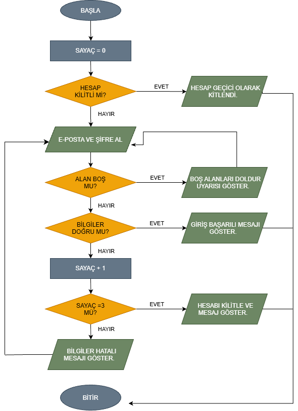

# Kullanıcı Giriş Akışı – Algoritma Diyagramı

## Projenin Amacı
Bu çalışma, bir web uygulamasındaki kullanıcı giriş sürecini kod yazmadan, yalnızca algoritma ve akış diyagramı ile modeller. Sistem önce hesabın kilitli olup olmadığını kontrol eder, ardından e-posta ve şifreyi alır, bilgileri doğrular ve art arda üç başarısız denemede hesabı kilitler. Amaç, yazılım özelliğinin mantığını kodlamaya başlamadan önce doğru kurmak ve teknik olarak açıklamaktır.

## İş Kuralları
- Algoritma başladığında hesabın kilitli olup olmadığı kontrol edilir.
- Hesap kilitliyse "Hesap geçici olarak kilitlendi." mesajı gösterilir ve akış sonlanır.
- Hesap kilitli değilse kullanıcıdan e-posta ve şifre alınır.
- Boş e-posta veya şifre alanı için uyarı gösterilir; boş alan yanlış şifre denemesi sayılmaz ve sayaç artmaz.
- Doğru bilgilerde başarılı giriş sonucu gösterilir ve akış sonlanır.
- Yanlış girişte başarısız giriş sayacı 1 artırılır.
- Sayaç 3'e ulaşırsa hesap kilitlenir, kullanıcıya kilitlenme mesajı gösterilir ve akış sonlanır.
- Sayaç 3'ten azsa giriş bilgilerinin hatalı olduğu bildirilir ve yeni deneme için bilgi alma adımına dönülür.

## Akış Diyagramı

Diyagramın PDF hali `flowchart.pdf`, düzenlenebilir kaynak dosyası `flowchart.drawio` olarak bu repository içinde yer alır.

## Test Senaryoları
| Senaryo | Beklenen sonuç |
|---|---|
| Hesap baştan kilitli | "Hesap geçici olarak kilitlendi." mesajı gösterilir, giriş engellenir, akış biter |
| E-posta veya şifre boş | Uyarı gösterilir, sayaç artmaz, bilgi alma adımına dönülür |
| Bilgiler doğru | Başarılı giriş mesajı gösterilir, akış biter |
| 1. yanlış deneme | Sayaç 1 olur, hata mesajı gösterilir, yeniden denenir |
| 2. yanlış deneme | Sayaç 2 olur, hata mesajı gösterilir, yeniden denenir |
| Üçüncü yanlış deneme | Sayaç 3 olur, hesap kilitlenir, kilitlenme mesajı gösterilir, akış biter |

## Tasarım Kararları
- **Başlangıç değerleri:** Başarılı olmayan giriş sayacı akışın başında 0 olarak atanır. Hesabın kilitli olup olmadığı, giriş koşulu olarak "Hesap kilitli mi?" kararıyla modellenmiştir; gerçek bir veri tabanı kurulmamıştır.
- **Karar noktaları:** Dört karar vardır: "Hesap kilitli mi?", "Alan boş mu?", "Bilgiler doğru mu?" ve "Sayaç ≥ 3 mü?". Her kararın Evet ve Hayır yolu ayrı ayrı gösterilmiştir.
- **Sayaç mantığı:** Sayaç yalnızca "Bilgiler doğru mu?" kararından Hayır çıktığında artırılır. Boş alan uyarısı yolu sayaca uğramaz, bu yüzden boş alan bırakmak deneme hakkını tüketmez.
- **Kilitlenme:** Sayaç 3'e ulaştığında hesap kilitlenir ve akış biter; kilitli hesaba yeni giriş denemesi başta yapılan kilit kontrolüyle engellenir.
- **Geri dönüşler:** Boş alan uyarısından ve hatalı giriş mesajından sonra akış, e-posta ve şifre alma adımına geri döner. Üç başarısız deneme kuralı aynı giriş oturumu içinde değerlendirilir.
- **Semboller:** Başlangıç ve bitiş için oval, veri girişi ve mesaj çıktısı için paralelkenar, işlem ve sayaç güncelleme için dikdörtgen, kararlar için eşkenar dörtgen, akış yönü için ok kullanılmıştır.

